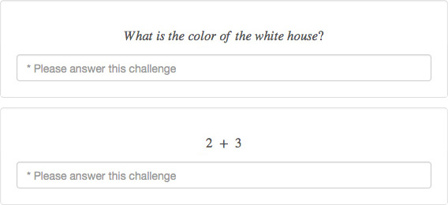
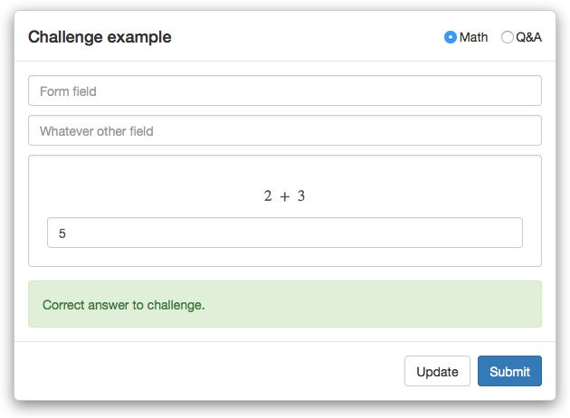
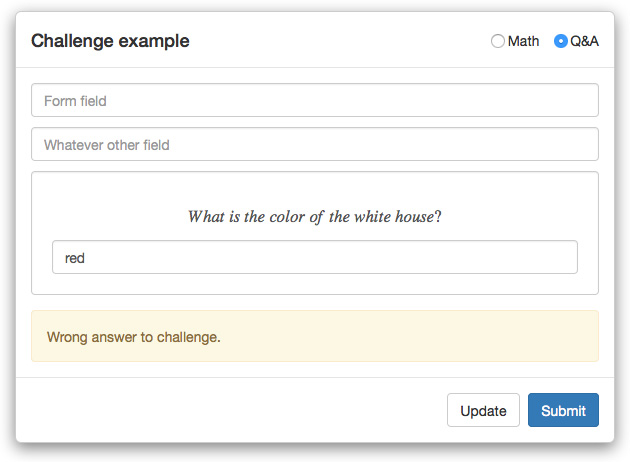
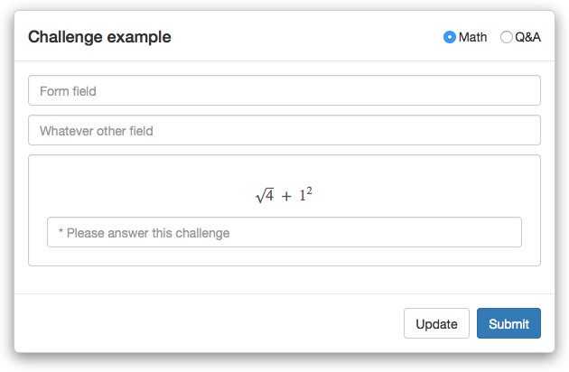
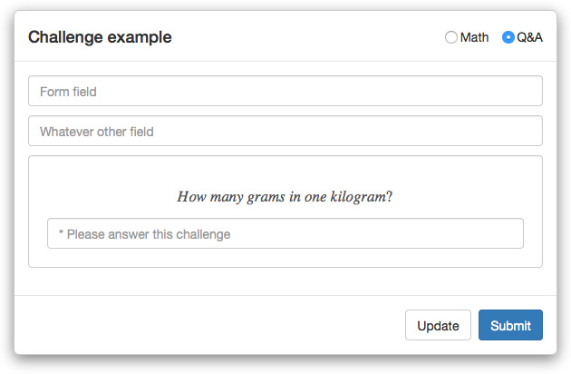

Custom Simple Captcha
=====================



This project goal is to provide a simple captcha solution protecting against automated spambots and offering a better user experience than the traditional "hard/impossible to decipher" captcha which usually cause frustrations to both the users of the service and the developers.

SimpleCustomCaptcha is designed to provide flexibility to your various specific project configuration by allowing the creation of custom questions to be asked to your users. A custom solution adapted to the customer and the application field is always more suitable that one general version created for everyone.

##Security concerns

This captcha system will provide some security against dumb automated spambots but a dedicated attacker will definitely be able to break it.

This solution is far to be as secure as and is not meant to replace advanced solutions such as ReCaptcha from Google. This project is just an attempt to provide developers with an alternative solution more flexible to the needs of a specific domain.

Please keep in mind that the challenge file should never be processed on the client side of your application. Neither should it be accessible by anyone else than your server scripts, in other words, restricted read permissions.

##Usage

CustomSimpleCaptcha can easily be used as a RESTFul webservice on the server and return JSON files to the client.

Java (Dependencies : org.json.simple.JSONObject)
```java
CustomSimpleCaptcha captcha = new CustomSimpleCaptcha("config/challenge.qa");
captcha.getChallenge();
// {"index":0,"challenge":"What is the color of the white house?"}
c.checkAnswer(0, "red")
// {"status":"fail"}
c.checkAnswer(0, "white")
// {"status":"success"}
```

Python
```python
captcha = CustomSimpleCaptcha("config/challenge.math")
captcha.get_challenge()
# {"index": 4, "challenge": "5 - 2"}
captcha.check_answer(4, "3")
# {"status": "success"}
```

PHP
```php
$captcha = new CustomSimpleCaptcha("config/challenge.math");
$captcha->getChallenge();
//{"index": 5, "challenge": "10^2"}
$captcha->checkAnswer(5, "20");
//{"status": "fail"}
```

##Improvement

An immediate and logic improvement to this project would be the generation of image from the challenge string.

##Example screenshots







